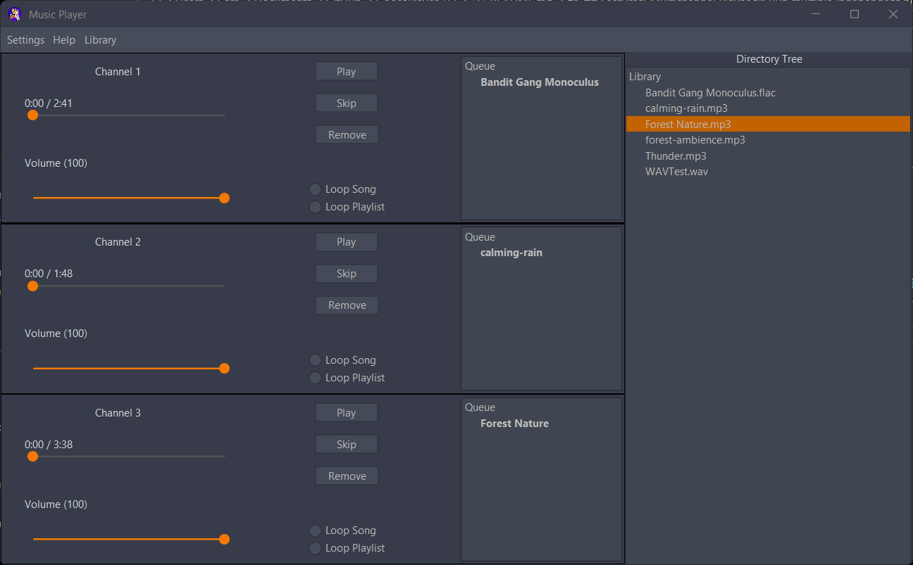
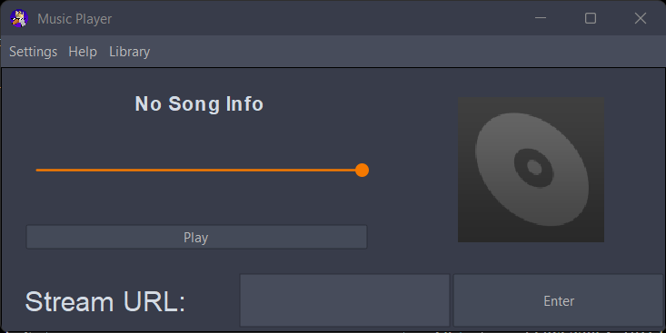

README
-----------------------------------------------------------------------------------------------------------------------------------------------------------------------------
    GoosePlayer V2: Senior Capstone Project
-----------------------------------------------------------------------------------------------------------------------------------------------------------------------------
Team Members:
    Joshua Anderson, Camillus Settanni
-----------------------------------------------------------------------------------------------------------------------------------------------------------------------------
Background:
    This is an MP3 Player that can be used for a variety of things such as DnD or local music server streaming. Originally started when I was practicing data structures and recursion for college and snowballed into this Capstone project. I call this version 2 because I did most of the structure without Maven and when I needed to add Maven packages because Java does not have good audio handling implementation it entailed an entire restructure of the code.
-----------------------------------------------------------------------------------------------------------------------------------------------------------------------------
Features:
    -Multichannel Playback: Run multiple independent players in one window (great for ambient mixing or separate playlists for DnD or other occasions).
    -Drag-and-Drop Queue: Add single files or entire folders of compatable music files instantly.
    -Supported Formats: MP3, WAV, FLAC with embedded album art support.
    -Looping Modes: Loop current song or entire playlist.
    -Gapless Preloading: Smooth transitions by preloading the next track.
    -Custom Queue with History: See played tracks and jump back easily.
    -Shuffle & Remove: Full queue management with visual feedback (bold current track).
    -Volume & Seek Controls: Intuitive sliders and progress bar.
    -Portable: Single executable JAR — no installation required.
-----------------------------------------------------------------------------------------------------------------------------------------------------------------------------
System Requirements:
Recommended Hardware Configuration:
    -OS: Windows 11
    
    -Processor: Intel I5 or higher processor, at least 12th gen
    
    -RAM: 16GB or higher recommended to allow for clean desktop experience while operating other applications.
-----------------------------------------------------------------------------------------------------------------------------------------------------------------------------
Usage:
    There are three modes: 
    MonoPlayer (Single-channel playback) : ideal for everyday music listening   
    MultiPlayer: Multiple independent channels in one window — perfect for mixing sounds (e.g., rain + forest for DnD)  
    Radio: Streaming local radio player 
        1. Add Music:
        - Drag and drop files/folders onto the queue area (bottom or right panel).
        - Double-click a track in the queue to jump to it immediately.

        2. Playback Controls:
        - Play/Pause button (center)
        - Skip to next track
        - Shuffle queue
        - Remove selected track
        - Clear entire queue

        3. Looping:
        - "Loop Song" – repeats current track
        - "Loop Playlist" – restarts queue when finished

        4. Multichannel:
        - Additional players appear as tabs/channels for simultaneous playback.

        5. Album Art:
        - Automatically shows embedded artwork or falls back to default icon.

-----------------------------------------------------------------------------------------------------------------------------------------------------------------------------
Install:
    -JDK 17: (Make sure to install Java first. For this player we used the Java 17 Platform) https://www.oracle.com/java/technologies/javase/jdk17-archive-downloads.html
    
    -Apache Maven 3.9.11: Download from: https://maven.apache.org/download.cgi Follow installation instructions: https://maven.apache.org/install.html 
    (Verify with mvn -version in your terminal.)

    -IDE: Visual Studio Code (Recommended, although it shouldn't be a problem to use a different IDE such as IntelliJ or Eclipse)
-----------------------------------------------------------------------------------------------------------------------------------------------------------------------------
Included in this File:
    README.md (this file): Project documentation, including installation instructions, usage guide, and overview.
    
    pom.xml: Maven configuration file that defines the project version (1.1.4), dependencies (e.g., Beads audio library, JAudioTagger for metadata and album art, Swing for the UI), and build settings.
    
    src/main/java/com/gooseplayer2/(Core application source): 
        codeJPanels/MusicPlayer.java: Main music player panel implementing playback controls, queue management, progress bar, volume, looping modes, and UI integration.
        
        MainFrame.java: Primary application window with support for multichannel players and layout management.
        
        Other packages and classes: Custom queue implementation (Queue.java), file handling, drag-and-drop support, audio context setup, and utility classes.

    src/main/resources/icons/: Default album art (e.g., albumMissing.png) and other UI icons used when metadata artwork is unavailable.
    
    src/test/java/com/gooseplayer2/: Contains 50+ regression tests covering player modes, playback functions, queue operations, looping behavior, and edge cases.
    
    target/ (generated on build): Contains the compiled executable JAR (e.g., gooseplayer2-1.1.4.jar) after running mvn package.
-----------------------------------------------------------------------------------------------------------------------------------------------------------------------------
Player Setup Instructions:
    For the Casual User:
        1. Simply click on the GoosePlayer shortcut (GoosePlayer2.lnk) located in the GoosePlayer_V2 folder (or directly run the provided gooseplayer2-1.1.4.jar located in GoosePlayer_V2\gooseplayer2\target if the shortcut is missing) to start the Player
    
    For those who wish to edit the player or inspect the build:
        1. Ensure that Java 17 or higher is installed along with Maven
        
        2. Open the terminal/command prompt in the IDE of your choosing
        
        3. Run the command (mvn clean package) in for a clean build. This generates (or updates) the executable JAR in the target/ folder.
            NOTE: the tests that will auto-run are expecting 6 songs or more in the \GoosePlayer_V2\gooseplayer2\Library folder so if there are none than temporarily disable
        
        4. Run the freshly built player: java -jar target\gooseplayer2-1.1.4-jar-with-dependencies.jar (Or simply double-click the updated JAR.)
        
        5. To edit the code: Open the project in your preferred IDE. Source code is located in src/main/java/com/gooseplayer2/.
-----------------------------------------------------------------------------------------------------------------------------------------------------------------------------
Known Issues:
- No playlist save/load yet (future feature).
- Azuracast support for internet streaming of radio players is still a work in progress
-----------------------------------------------------------------------------------------------------------------------------------------------------------------------------
Licence:
Copyright 2025 Gibby990

Permission is hereby granted, free of charge, to any person obtaining a copy of this software and associated documentation files (the “Software”), to deal in the Software without restriction, including without limitation the rights to use, copy, modify, merge, publish, distribute, sublicense, and/or sell copies of the Software, and to permit persons to whom the Software is furnished to do so, subject to the following conditions:

The above copyright notice and this permission notice shall be included in all copies or substantial portions of the Software.

THE SOFTWARE IS PROVIDED “AS IS”, WITHOUT WARRANTY OF ANY KIND, EXPRESS OR IMPLIED, INCLUDING BUT NOT LIMITED TO THE WARRANTIES OF MERCHANTABILITY, FITNESS FOR A PARTICULAR PURPOSE AND NONINFRINGEMENT. IN NO EVENT SHALL THE AUTHORS OR COPYRIGHT HOLDERS BE LIABLE FOR ANY CLAIM, DAMAGES OR OTHER LIABILITY, WHETHER IN AN ACTION OF CONTRACT, TORT OR OTHERWISE, ARISING FROM, OUT OF OR IN CONNECTION WITH THE SOFTWARE OR THE USE OR OTHER DEALINGS IN THE SOFTWARE.

